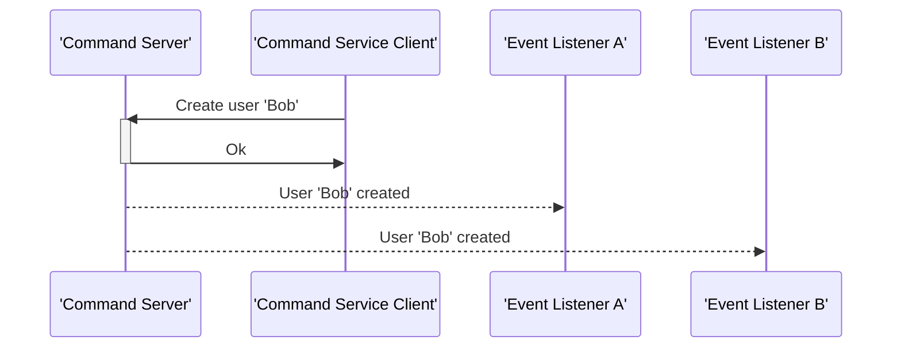

# cqrs-rust

A simple command server/command service client written in Rust.

Requirements:
* cargo
* cmake (for librdkafka)
* protoc

Visual example:

As this project is still early stage, it's advised not to use it in production-grade environments. 
Contributions are welcome.

# Future improvements
* Introduce a state store to allow for snaphot based recovery of the command server state
* Improve the developer experience
* Fully introduce Rust-style error handling
  

