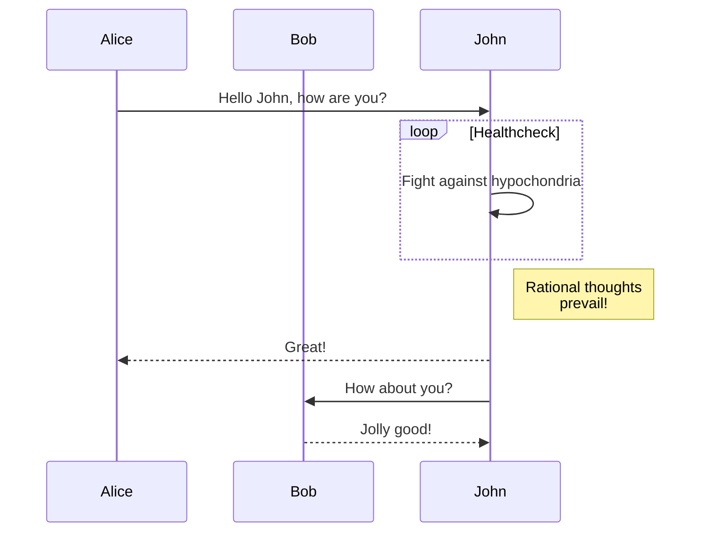

# cqrs-rust

A simple command server/command service client written in Rust.

Requirements:
* cargo
* cmake (for librdkafka)
* protoc

Visual example:

```mermaid
sequenceDiagram
    participant Alice
    participant Bob
    Alice->>John: Hello John, how are you?
    loop Healthcheck
        John->>John: Fight against hypochondria
    end
    Note right of John: Rational thoughts <br/>prevail!
    John-->>Alice: Great!
    John->>Bob: How about you?
    Bob-->>John: Jolly good!
```

# WARNING: Don't use in production

